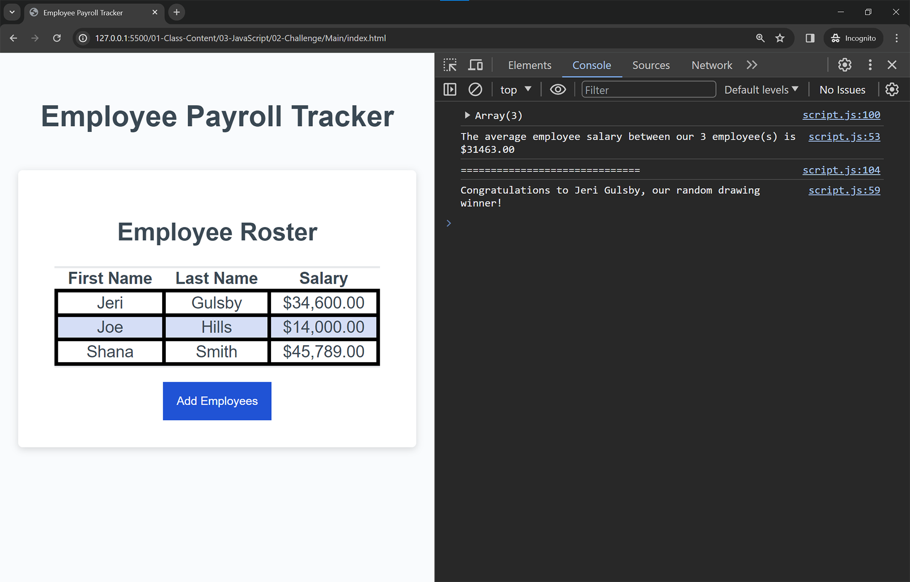

# 🤓 Module-3-Challenge
On the job ticket

# Employee Payroll Tracker Starter Code

## USER STORY

* As a payroll manager I WANT an employee payroll tracker so that I can see my employees' payroll data and properly budget for the company.

## ACCEPTANCE CRITERIA

* It's done when I click the "Add employee" button then I am presented with a series of prompts asking for first name, last name, and salary.

* It's done I finish adding an employee then I am prompted to continue or cancel.

* It's done when I choose to continue then I am prompted to add a new employee.

* It's done When I choose to cancel then my employee data is displayed on the page sorted alphabetically by last name, and the console shows computed and aggregated data. 

## Assets

The following images show the web application's appearance and functionality:

© 2024 edX Boot Camps LLC. Confidential and Proprietary. All Rights Reserved.

